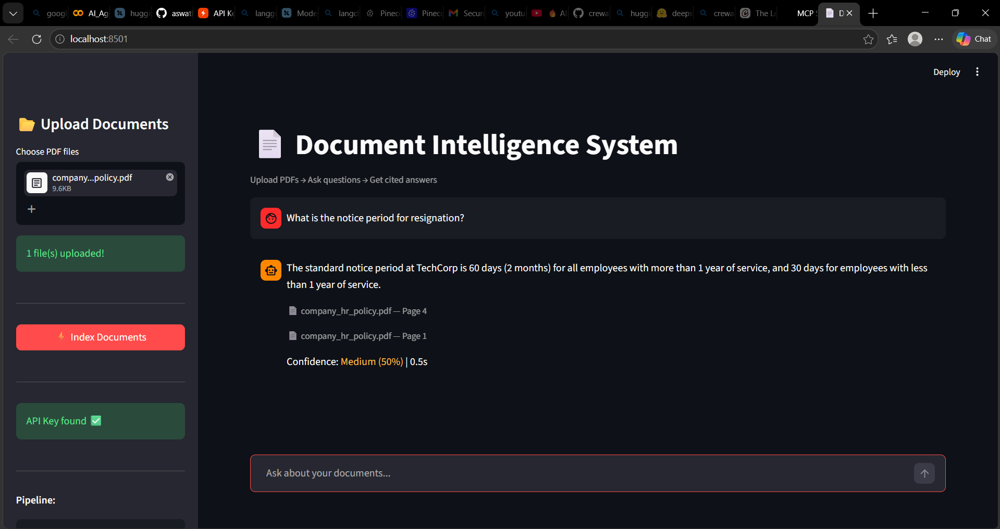
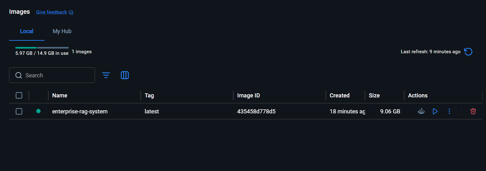
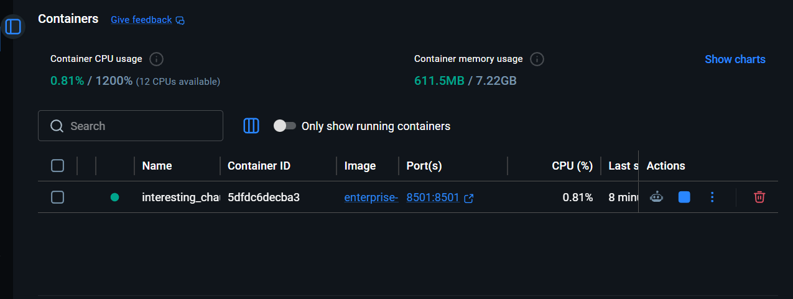

# 📄 Enterprise Document Intelligence System

An AI-powered document Q&A system. Upload PDFs and ask questions — get accurate answers with source citations and confidence scoring.

-----

## 📸 Output



-----

## ⚙️ Installation

### 1. Change to your current directory

```bash
cd enterprise-rag-system
```

### 2. Create Virtual Environment

```bash
uv python pin 3.11
uv venv --python 3.11
```

### 3. Activate Virtual Environment

```bash
# Windows
.venv\Scripts\activate

# Mac/Linux
source .venv/bin/activate
```

### 4. Install Dependencies

```bash
uv pip install -r requirements.txt
```

### 5. Add API Key

Create a `.env` file in the project root:

```env
GROQ_API_KEY=gsk_your_key_here
```

Get your free Groq API key at [console.groq.com](https://console.groq.com)

### 6. Run the App

```bash
streamlit run src/app.py
```

# Docker Setup – Enterprise RAG System

## Prerequisites
- [Docker Desktop](https://www.docker.com/products/docker-desktop/) installed and running
- .env file with your API keys in the project root

## Environment Variables
Create a .env file in the root directory:

## Build the Image
```bash
docker build -t enterprise-rag-system .
```


## Run the container
```bash
docker run -d -p 8501:8501 --name rag-app --env-file .env enterprise-rag-system
```


# Access the App
Open browser at: http://localhost:8502/

## K8S
## create deployment.yaml file 
```bash
kubectl apply -f Deployment.yaml
```
```bash
kubectl delete -f Deployment.yaml
```
```bash
kubectl get nodes
```
```bash
kubectl get pods
```
```bash
kubectl get service
```


